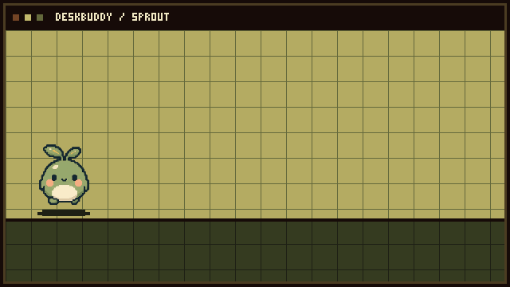

# DeskBuddy

DeskBuddy creates animated desktop sprites from a preset, an imported sprite sheet, or frames drawn in the app. Sprites use separate idle and walk animations, move across the desktop, and wrap from one screen edge to the other.

<picture>
  <source media="(prefers-reduced-motion: reduce)" srcset="docs/assets/deskbuddy-demo-still.png">
  
</picture>

Built with Electron and JavaScript.

## Project website

The static DeskBuddy website lives in [`docs/`](docs/index.html), with a [sprite and setup guide](docs/guide/index.html). It uses plain HTML, CSS, and JavaScript with no build step or third-party assets.

To publish it after pushing this repository to GitHub, open **Settings → Pages**, choose **Deploy from a branch**, then select the `main` branch and `/docs` folder.

## Run it on Mac or Windows

1. Install [Node.js](https://nodejs.org/) (version 22.12 or later). On Mac, Electron 44 requires macOS 13 or later.
2. Open Terminal (Mac) or PowerShell (Windows) in this `deskbuddy` folder.
3. Run:

   ```sh
   npm install
   npm run dev
   ```

4. Choose a **Starter buddy**, **Import sprite sheet**, or **Draw your own**, then select **Create & launch**.

Your buddy appears as only a transparent sprite—no border, white card, hover buttons, heart, or exit control. Drag the sprite itself anywhere. New buddies start at `112 px` and can be sized from `64 px` to `192 px`. They switch to their walk frames while moving, return to idle when they stop, and wrap to the opposite side after walking fully past any screen edge. With multiple buddies open, each one wanders on its own staggered schedule and picks a different recent direction.

## Make a sprite

### Pick a starter buddy

Open **Starter buddies**, choose a character, adjust its name and size, then select **Create & launch**. Every bundled starter includes four idle frames and four walking frames with a transparent background.

### Import a sprite sheet

DeskBuddy accepts a **transparent PNG only!!!!**
After upload, it shows multiple square-cell grid choices such as `4 × 1 · 256px` or `12 × 8 · 32px`. Pick the one that puts one complete character in each cell, then choose each clip's row, starting column, and frame count. A common layout is four idle frames on row 1 and four walk frames on row 2.

The source must be the clean PNG sprite sheet—not a screenshot with a checkerboard background, labels, grid lines, borders, or a white background. JPG and WebP files are deliberately rejected because they cannot reliably preserve transparency.

### Drawing a sprite in DeskBuddy

Switch to **Draw your own**. Choose your desired brush color and size, draw the current frame, then use **Add frame** for the next pose. Make at least one visible `Idle` frame and one visible `Walk` frame for it to create a sprite. Turn on **Previous frame** to see a semi-transparent onion-skin reference while drawing the next frame; it is never saved into your art.

For the full workflow and layout examples, see [`docs/SPRITE_WORKFLOWS.md`](docs/SPRITE_WORKFLOWS.md).

## Create an app file

After `npm install`, run:

```sh
npm run dist
```

On Windows, the portable `.exe` is created in `release/`. On a Mac, a `.dmg` is created there instead.

## App icon

DeskBuddy uses Sprout's first idle frame for its app and Dock icon. If that source artwork changes, rebuild the icon with:

```sh
npm run icon
```

## Privacy and safety choices

- Sprites are copied into DeskBuddy's private app-data folder; nothing is uploaded.
- Only PNGs with real transparent pixels and visible artwork are accepted.
- Each source image is limited to 5 MB and 16 megapixels. Animation sets are limited to eight frames per clip and 12 MB total.
- The renderer cannot access Node.js or your file system directly.

## Development check

```sh
npm run check
```

Regenerate the README animation and its reduced-motion still from Sprout's bundled walk frames with:

```sh
npm run demo-gif
```

This project includes source code only. Run it on your Mac or Windows desktop to test the transparent companion window, then package it with `npm run dist`.
